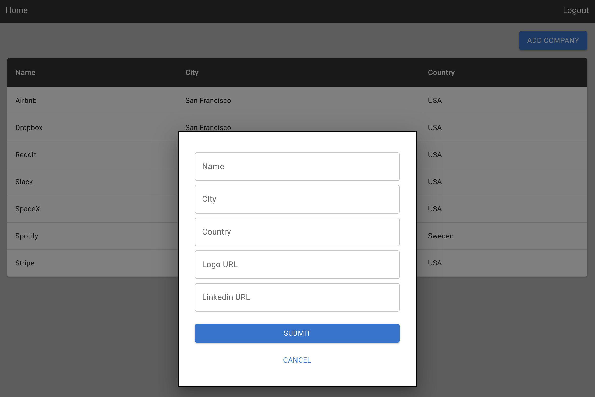

# Company Metric Tracker

This repo [^1] contains a project that enables users to store company information and financial metrics. Users can login, view and add companies, and update fields pertaining to  their industry, business models, and financial metrics.

### DB Diagram
This is an external link to a diagram  of the database. I have also included a snapshot image of the database diagram on the root folder of the repo.

https://dbdiagram.io/d/64e3ae9002bd1c4a5e25ba4d

### To Use
1. Clone repo locally
2. Install Docker and Python and NPM on your local machine
3. Open docker
4. Run docker-compose build
5. Run docker-compose up (AND wait until all containers are spun up)
6. Run docker-compose run fastapi_be alembic upgrade head
7. Go to localhost:8000/docs and use the auth/create-user endpoint to create an account
8. Go to localhost:3000 and login with your credentials
9. Use the webapp 

There should be some companies already loaded in the DB for you to mess around with. 

### Screenshots

#### Home Screen 

#### Add Company Form

#### Company Profile Page

[^1]: This repo was forked from my template repo for a webapp that can be found publicly using the following link. https://github.com/iyhasan/fastapi-react-template-monorepo
